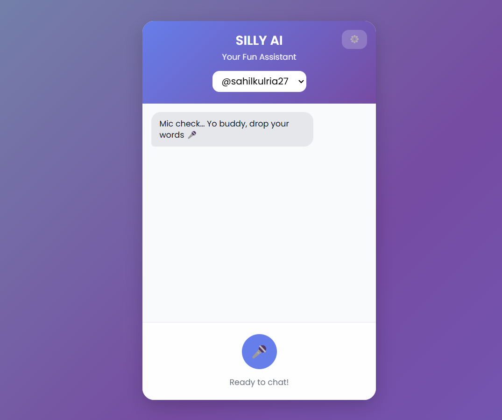

<p align="center">
  
</p>

<h1 align="center">🎭 Silly AI — Your Fun Voice Assistant</h1>

<p align="center">
  A quirky, PWA-ready voice assistant that listens, laughs, and replies with style.  
  <br/>Speak naturally, get witty responses, hear lifelike voice replies, and enjoy a playful UI.
</p>

<p align="center">
  <a href="https://img.shields.io/badge/Python-3.10%2B-3776AB?logo=python&logoColor=white"></a>
  <a href="https://img.shields.io/badge/FastAPI-⚡-009688?logo=fastapi&logoColor=white"></a>
  <a href="https://img.shields.io/badge/PWA-Ready-5A0FC8?logo=pwa&logoColor=white"></a>
  <a href="https://img.shields.io/badge/License-MIT-blue"></a>
</p>

---

## ✨ Highlights

- 🎤 **Conversational voice chat** with fun personality  
- 📝 **Text-only chat** for quick testing  
- 🔊 **Speech-to-text & lifelike voice replies**  
- 🎨 **Playful, animated UI** with smooth interactions  
- 📱 **Installable PWA** with offline caching  
- 🔐 **API key config** via `.env` or in-app settings  

<div align="center">
  
  <br/>
  <sub>Clean & fun UI — always ready to chat!</sub>
</div>

---

## 🧭 Table of Contents

1. [Quickstart](#-quickstart)
2. [Environment & Config](#-environment--config)
3. [Architecture](#-architecture)
4. [Core Features](#-core-features)
5. [Project Structure](#-project-structure)
6. [Deployment](#-deployment)
7. [License](#-license)

---

## 🚀 Quickstart

### Prerequisites
- Python 3.10+  
- API keys for Speech-to-Text, LLM, and TTS  


python -m venv .venv
source .venv/bin/activate   # macOS/Linux
. .\.venv\Scripts\Activate.ps1  # Windows

# Install deps
pip install -r requirements.txt

# Add your keys to .env
python app.py


Open: 👉 http://localhost:8000


## 🔐 Environment & Config

Create a `.env` file inside `uploads/`:

ASSEMBLYAI_API_KEY=your_key
GEMINI_API_KEY=your_key
MURF_API_KEY=your_key
SECRET_KEY=optional_secret_for_encryption


---

### 🧩 Architecture  
```markdown
## 🧩 Architecture

sequenceDiagram
    autonumber
    participant U as 👤 User
    participant B as 🌐 Browser (Silly AI UI)
    participant API as ⚡ FastAPI Backend
    participant STT as 🎙️ AssemblyAI (STT)
    participant LLM as 🧠 Google Gemini (LLM)
    participant TTS as 🔊 Murf AI (TTS)

    U->>B: 🎤 Speak
    B->>API: 📩 POST /llm/query (audio + session_id)
    API->>STT: 🎙️ Transcribe Audio
    STT-->>API: 📄 Transcript
    API->>LLM: 💬 Chat with Context (session history)
    LLM-->>API: 🤖 LLM Response
    API->>TTS: 🔊 Convert to Voice
    TTS-->>API: 🎵 Audio File (mp3)
    API-->>B: 📦 { transcript, llmResponse, audioFile }
    B-->>U: 📝 Show Text + ▶ Play Audio


## 🗂️ Project Structure

```bash
Silly-AI/
├─ app.py                # FastAPI app
├─ config.py             # Config & key mgmt
├─ schemas.py            # Pydantic models
├─ services/             # API integrations (STT, LLM, TTS)
├─ templates/            # HTML frontend
├─ static/               # JS, CSS, icons
├─ uploads/              # User configs & data
├─ image/                # Logo & screenshots
├─ requirements.txt      # Python deps
├─ Dockerfile            # Deployment
└─ README.md             # You are here
